# Introduction

This is the open source program of the CALF paper.
This source code is a fork of the HMP repository.
The Hybrid Multi-agent Playground (HMP) is an experimental framework designed for Reinforcement Learning (RL) researchers.
Unlike any other framework which only isolates the TASKs from the framework, 
HMP also separates the ALGORITHMs from the framework to achieve excellent compatibility.


# CALF

reproduction method:

- start docker container:
```
docker run -itd   --name  hmp-$USER \
--net host \
--gpus all \
--shm-size=16G \
fuqingxu/hmp:latest
```

- clone this resp:
```
git clone https://github.com/binary-husky/CALF.git
```

- run calf:
```
python autorl_script.py
```

# structure

```mermaid
flowchart LR
    %% <gpt_academic_hide_mermaid_code> 一个特殊标记，用于在生成mermaid图表时隐藏代码块
    classDef Comment stroke-dasharray: 5 5
    subgraph project_map
        R0000["🗎autorl_script.py"] -.-x CR0000["`The file a
        utorl_scri
        pt.py is a
         script fi
        le for an ...`"]:::Comment
        R000[["📁CALF"]] --> R0000["🗎autorl_script.py"]
        R0001["🗎main.py"] -.-x CR0001["`The main.p
        y file in 
        CALF.zip.e
        xtract/CAL
        F is the m...`"]:::Comment
        R000[["📁CALF"]] --> R0001["🗎main.py"]
        R0002["🗎multi_team.py"] -.-x CR0002["`The multi_
        team.py fi
        le is a pa
        rt of the 
        CALF sof...`"]:::Comment
        R000[["📁CALF"]] --> R0002["🗎multi_team.py"]
        R0003["🗎multi_team_parallel.py"] -.-x CR0003["`The code f
        ile multi_
        team_paral
        lel.py is 
        a part o...`"]:::Comment
        R000[["📁CALF"]] --> R0003["🗎multi_team_parallel.py"]
        R0004["🗎cradle.py"] -.-x CR0004["`The code i
        n the file
         cradle.py
         adds an a
        uthor's ...`"]:::Comment
        R000[["📁CALF"]] --> R0004["🗎cradle.py"]
        R0005["🗎multi_server.py"] -.-x CR0005["`The file m
        ulti_serve
        r.py is a 
        Python scr
        ipt file...`"]:::Comment
        R000[["📁CALF"]] --> R0005["🗎multi_server.py"]
        R0006["🗎config.py"] -.-x CR0006["`The config
        .py file s
        ets the gl
        obal confi
        guration...`"]:::Comment
        R000[["📁CALF"]] --> R0006["🗎config.py"]
        R0007["🗎task_runner.py"] -.-x CR0007["`The progra
        m in task_
        runner.py 
        is a task 
        runner f...`"]:::Comment
        R000[["📁CALF"]] --> R0007["🗎task_runner.py"]
        R00080["🗎example_foundation.py"] -.-x CR00080["`The code i
        n the file
         example_f
        oundation.
        py defin...`"]:::Comment
        R0008[["📁ALGORITHM"]] --> R00080["🗎example_foundation.py"]
        R000810["🗎net.py"] -.-x CR000810["`The net.py
         file is a
         module th
        at contain
        s variou...`"]:::Comment
        R00081[["📁conc"]] --> R000810["🗎net.py"]
        R000811["🗎foundation.py"] -.-x CR000811["`The file f
        oundation.
        py is part
         of the CA
        LF algor...`"]:::Comment
        R00081[["📁conc"]] --> R000811["🗎foundation.py"]
        R000812["🗎ppo.py"] -.-x CR000812["`The given 
        program fi
        le is name
        d ppo.py a
        nd is lo...`"]:::Comment
        R00081[["📁conc"]] --> R000812["🗎ppo.py"]
        R000813["🗎trajectory.py"] -.-x CR000813["`The file t
        rajectory.
        py is a Py
        thon modul
        e that con...`"]:::Comment
        R00081[["📁conc"]] --> R000813["🗎trajectory.py"]
        R000814["🗎shell_env.py"] -.-x CR000814["`The file s
        hell_env.p
        y is a par
        t of the C
        ALF proj...`"]:::Comment
        R00081[["📁conc"]] --> R000814["🗎shell_env.py"]
        R0008[["📁ALGORITHM"]] --> R00081[["📁conc"]]
        R000820["🗎uhmap_bb.py"] -.-x CR000820["`The code f
        ile uhmap_
        bb.py cont
        ains sever
        al class...`"]:::Comment
        R00082[["📁script_ai"]] --> R000820["🗎uhmap_bb.py"]
        R000821["🗎decision.py"] -.-x CR000821["`The file d
        ecision.py
         is a scri
        pt that de
        fines a ...`"]:::Comment
        R00082[["📁script_ai"]] --> R000821["🗎decision.py"]
        R0008[["📁ALGORITHM"]] --> R00082[["📁script_ai"]]
        R000[["📁CALF"]] --> R0008[["📁ALGORITHM"]]


        
    end
```

```mermaid
flowchart LR
    %% <gpt_academic_hide_mermaid_code> 一个特殊标记，用于在生成mermaid图表时隐藏代码块
    classDef Comment stroke-dasharray: 5 5
    subgraph project_map
        R000000["🗎assignment.py"] -.-x CR000000["`The file a
        ssignment.
        py is a Py
        thon scrip
        t for th...`"]:::Comment
        R00000[["📁script_ai"]] --> R000000["🗎assignment.py"]
        R000001["🗎manual.py"] -.-x CR000001["`The file m
        anual.py c
        ontains th
        e implemen
        tation o...`"]:::Comment
        R00000[["📁script_ai"]] --> R000001["🗎manual.py"]
        R000002["🗎dummy.py"] -.-x CR000002["`This file 
        is named d
        ummy.py an
        d is locat
        ed in th...`"]:::Comment
        R00000[["📁script_ai"]] --> R000002["🗎dummy.py"]
        R000003["🗎module_evaluation.py"] -.-x CR000003["`The file m
        odule_eval
        uation.py 
        is an impl
        ementati...`"]:::Comment
        R00000[["📁script_ai"]] --> R000003["🗎module_evaluation.py"]
        R000004["🗎blue_strategy.py"] -.-x CR000004["`The file b
        lue_strate
        gy.py is a
         Python sc
        ript for...`"]:::Comment
        R00000[["📁script_ai"]] --> R000004["🗎blue_strategy.py"]
        R000005["🗎uhmap_ls_mp.py"] -.-x CR000005["`This file 
        is a Pytho
        n script n
        amed uhmap
        _ls_mp.py...`"]:::Comment
        R00000[["📁script_ai"]] --> R000005["🗎uhmap_ls_mp.py"]
        R000006["🗎uhmap_ls.py"] -.-x CR000006["`The given 
        file uhmap
        _ls.py con
        tains seve
        ral clas...`"]:::Comment
        R00000[["📁script_ai"]] --> R000006["🗎uhmap_ls.py"]
        R000007["🗎global_params.py"] -.-x CR000007["`The file g
        lobal_para
        ms.py cont
        ains a Pyt
        hon scri...`"]:::Comment
        R00000[["📁script_ai"]] --> R000007["🗎global_params.py"]
        R000008["🗎red_strategy.py"] -.-x CR000008["`The file r
        ed_strateg
        y.py is a 
        script tha
        t contains...`"]:::Comment
        R00000[["📁script_ai"]] --> R000008["🗎red_strategy.py"]
        R000009["🗎uhmap_island.py"] -.-x CR000009["`The file u
        hmap_islan
        d.py is a 
        Python scr
        ipt file...`"]:::Comment
        R00000[["📁script_ai"]] --> R000009["🗎uhmap_island.py"]
        R0000010["🗎dummy_uhmap.py"] -.-x CR0000010["`This code 
        file is na
        med dummy_
        uhmap.py a
        nd is lo...`"]:::Comment
        R00000[["📁script_ai"]] --> R0000010["🗎dummy_uhmap.py"]
        R0000011["🗎stance.py"] -.-x CR0000011["`The file s
        tance.py i
        s a part o
        f the ALGO
        RITHM ...`"]:::Comment
        R00000[["📁script_ai"]] --> R0000011["🗎stance.py"]
        R0000[["📁ALGORITHM"]] --> R00000[["📁script_ai"]]
        R000010["🗎mlp.py"] -.-x CR000010["`The mlp.py
         file is a
         module th
        at contain
        s three ...`"]:::Comment
        R00001[["📁common"]] --> R000010["🗎mlp.py"]
        R000011["🗎norm.py"] -.-x CR000011["`The file n
        orm.py con
        tains two 
        classes: D
        ynamicNorm...`"]:::Comment
        R00001[["📁common"]] --> R000011["🗎norm.py"]
        R000012["🗎alg_base.py"] -.-x CR000012["`The provid
        ed code fi
        le alg_bas
        e.py is a 
        Python m...`"]:::Comment
        R00001[["📁common"]] --> R000012["🗎alg_base.py"]
        R000013["🗎ppo_sampler.py"] -.-x CR000013["`The file p
        po_sampler
        .py is a P
        ython sour
        ce code fi...`"]:::Comment
        R00001[["📁common"]] --> R000013["🗎ppo_sampler.py"]
        R0000[["📁ALGORITHM"]] --> R00001[["📁common"]]
        R000[["📁CALF"]] --> R0000[["📁ALGORITHM"]]

    end
```

```mermaid
flowchart LR
    %% <gpt_academic_hide_mermaid_code> 一个特殊标记，用于在生成mermaid图表时隐藏代码块
    classDef Comment stroke-dasharray: 5 5
    subgraph project_map
        R000000["🗎net_manifest.py"] -.-x CR000000["`The code i
        n the file
         net_manif
        est.py is 
        used for i...`"]:::Comment
        R00000[["📁common"]] --> R000000["🗎net_manifest.py"]
        R000001["🗎traj.py"] -.-x CR000001["`The given 
        code is a 
        Python mod
        ule called
         traj.py...`"]:::Comment
        R00000[["📁common"]] --> R000001["🗎traj.py"]
        R000002["🗎onfly_config.py"] -.-x CR000002["`The file o
        nfly_confi
        g.py is a 
        Python scr
        ipt that...`"]:::Comment
        R00000[["📁common"]] --> R000002["🗎onfly_config.py"]
        R000003["🗎rl_alg_base.py"] -.-x CR000003["`The file r
        l_alg_base
        .py is a P
        ython modu
        le that ...`"]:::Comment
        R00000[["📁common"]] --> R000003["🗎rl_alg_base.py"]
        R000004["🗎attention.py"] -.-x CR000004["`The attent
        ion.py fil
        e provides
         implement
        ations o...`"]:::Comment
        R00000[["📁common"]] --> R000004["🗎attention.py"]
        R000005["🗎hyper_net.py"] -.-x CR000005["`The hyper_
        net.py fil
        e contains
         two class
        es: Hyp...`"]:::Comment
        R00000[["📁common"]] --> R000005["🗎hyper_net.py"]
        R000006["🗎traj_gae.py"] -.-x CR000006["`The code f
        ile traj_g
        ae.py is a
         module in
         the CALF ...`"]:::Comment
        R00000[["📁common"]] --> R000006["🗎traj_gae.py"]
        R000007["🗎logit2act.py"] -.-x CR000007["`The provid
        ed file is
         logit2act
        .py, which
         is part o...`"]:::Comment
        R00000[["📁common"]] --> R000007["🗎logit2act.py"]
        R000008["🗎pca.py"] -.-x CR000008["`The progra
        m file pca
        .py contai
        ns a Pytho
        n functi...`"]:::Comment
        R00000[["📁common"]] --> R000008["🗎pca.py"]
        R000009["🗎traj_manager.py"] -.-x CR000009["`The file t
        raj_manage
        r.py is a 
        part of th
        e CALF pro...`"]:::Comment
        R00000[["📁common"]] --> R000009["🗎traj_manager.py"]
        R0000010["🗎his.py"] -.-x CR0000010["`This progr
        am file, h
        is.py, is 
        written in
         Python an...`"]:::Comment
        R00000[["📁common"]] --> R0000010["🗎his.py"]
        R0000011["🗎conc.py"] -.-x CR0000011["`The file c
        onc.py con
        tains two 
        classes: C
        oncentrati...`"]:::Comment
        R00000[["📁common"]] --> R0000011["🗎conc.py"]
        R0000012["🗎dl_pool.py"] -.-x CR0000012["`The code i
        n the file
         dl_pool.p
        y defines 
        a class ...`"]:::Comment
        R00000[["📁common"]] --> R0000012["🗎dl_pool.py"]
        R0000[["📁ALGORITHM"]] --> R00000[["📁common"]]
        R000010["🗎__init__.py"] -.-x CR000010["`This file 
        is an init
        ialization
         file name
        d __init_...`"]:::Comment
        R00001[["📁stable_baselines3"]] --> R000010["🗎__init__.py"]
        R000011["🗎my_sac.py"] -.-x CR000011["`The file m
        y_sac.py i
        s a Python
         file that
         contain...`"]:::Comment
        R00001[["📁stable_baselines3"]] --> R000011["🗎my_sac.py"]
        R000012["🗎Baseline_Foundation.py"] -.-x CR000012["`The file B
        aseline_Fo
        undation.p
        y is part 
        of the CAL...`"]:::Comment
        R00001[["📁stable_baselines3"]] --> R000012["🗎Baseline_Foundation.py"]
        R0000[["📁ALGORITHM"]] --> R00001[["📁stable_baselines3"]]
        R000[["📁CALF"]] --> R0000[["📁ALGORITHM"]]

    end
```

```mermaid
flowchart LR
    %% <gpt_academic_hide_mermaid_code> 一个特殊标记，用于在生成mermaid图表时隐藏代码块
    classDef Comment stroke-dasharray: 5 5
    subgraph project_map
        R000000["🗎net.py"] -.-x CR000000["`The given 
        file is na
        med net.py
         and it is
         located i...`"]:::Comment
        R00000[["📁ppo_ma"]] --> R000000["🗎net.py"]
        R000001["🗎div_tree.py"] -.-x CR000001["`The code i
        n the file
         div_tree.
        py defines
         a PyTor...`"]:::Comment
        R00000[["📁ppo_ma"]] --> R000001["🗎div_tree.py"]
        R000002["🗎foundation.py"] -.-x CR000002["`The file f
        oundation.
        py is a Py
        thon sourc
        e code f...`"]:::Comment
        R00000[["📁ppo_ma"]] --> R000002["🗎foundation.py"]
        R000003["🗎ppo.py"] -.-x CR000003["`The file p
        po.py is a
         Python so
        urce code 
        file. It...`"]:::Comment
        R00000[["📁ppo_ma"]] --> R000003["🗎ppo.py"]
        R000004["🗎trajectory.py"] -.-x CR000004["`The file t
        rajectory.
        py is a Py
        thon modul
        e that con...`"]:::Comment
        R00000[["📁ppo_ma"]] --> R000004["🗎trajectory.py"]
        R000005["🗎ccategorical.py"] -.-x CR000005["`The given 
        program fi
        le is ccat
        egorical.p
        y from t...`"]:::Comment
        R00000[["📁ppo_ma"]] --> R000005["🗎ccategorical.py"]
        R000006["🗎shell_env.py"] -.-x CR000006["`The file s
        hell_env.p
        y is a Pyt
        hon script
         that co...`"]:::Comment
        R00000[["📁ppo_ma"]] --> R000006["🗎shell_env.py"]
        R0000[["📁ALGORITHM"]] --> R00000[["📁ppo_ma"]]
        R000010["🗎pymarl2_compat.py"] -.-x CR000010["`This progr
        am file is
         called py
        marl2_comp
        at.py an...`"]:::Comment
        R00001[["📁pymarl2_compat"]] --> R000010["🗎pymarl2_compat.py"]
        R000011["🗎mini_shell_uhmap.py"] -.-x CR000011["`The file m
        ini_shell_
        uhmap.py i
        s a Python
         file th...`"]:::Comment
        R00001[["📁pymarl2_compat"]] --> R000011["🗎mini_shell_uhmap.py"]
        R0000[["📁ALGORITHM"]] --> R00001[["📁pymarl2_compat"]]
        R000020["🗎gcortex.py"] -.-x CR000020["`The file g
        cortex.py 
        is a Pytho
        n module t
        hat impl...`"]:::Comment
        R00002[["📁coop_space_forwarding"]] --> R000020["🗎gcortex.py"]
        R000021["🗎coopgraph.py"] -.-x CR000021["`The file c
        oopgraph.p
        y is a Pyt
        hon module
         that cont...`"]:::Comment
        R00002[["📁coop_space_forwarding"]] --> R000021["🗎coopgraph.py"]
        R000022["🗎gcortex_qq.py"] -.-x CR000022["`This progr
        am file, g
        cortex_qq.
        py, contai
        ns a neura...`"]:::Comment
        R00002[["📁coop_space_forwarding"]] --> R000022["🗎gcortex_qq.py"]
        R000023["🗎reinforce_foundation.py"] -.-x CR000023["`The given 
        code file 
        is called 
        reinforce_
        foundatio...`"]:::Comment
        R00002[["📁coop_space_forwarding"]] --> R000023["🗎reinforce_foundation.py"]
        R000024["🗎ppo.py"] -.-x CR000024["`The ppo.py
         file is a
         Python mo
        dule that 
        implemen...`"]:::Comment
        R00002[["📁coop_space_forwarding"]] --> R000024["🗎ppo.py"]
        R000025["🗎trajectory.py"] -.-x CR000025["`The file t
        rajectory.
        py is a Py
        thon sourc
        e code fil...`"]:::Comment
        R00002[["📁coop_space_forwarding"]] --> R000025["🗎trajectory.py"]
        R000026["🗎my_utils.py"] -.-x CR000026["`This file 
        contains u
        tility fun
        ctions and
         classes u...`"]:::Comment
        R00002[["📁coop_space_forwarding"]] --> R000026["🗎my_utils.py"]
        R0000[["📁ALGORITHM"]] --> R00002[["📁coop_space_forwarding"]]
        R000[["📁CALF"]] --> R0000[["📁ALGORITHM"]]

    end
```

```mermaid
flowchart LR
    %% <gpt_academic_hide_mermaid_code> 一个特殊标记，用于在生成mermaid图表时隐藏代码块
    classDef Comment stroke-dasharray: 5 5
    subgraph project_map
        R0000000["🗎UhmapLargeScaleConf.py"] -.-x CR0000000["`The file C
        ALF.zip.ex
        tract/CALF
        /MISSION/u
        hmap/SubT...`"]:::Comment
        R000000[["📁SubTasks"]] --> R0000000["🗎UhmapLargeScaleConf.py"]
        R0000001["🗎UhmapJustAnIsland.py"] -.-x CR0000001["`The file U
        hmapJustAn
        Island.py 
        provides t
        he imple...`"]:::Comment
        R000000[["📁SubTasks"]] --> R0000001["🗎UhmapJustAnIsland.py"]
        R0000002["🗎UhmapInterceptConf.py"] -.-x CR0000002["`The file U
        hmapInterc
        eptConf.py
         is a conf
        iguratio...`"]:::Comment
        R000000[["📁SubTasks"]] --> R0000002["🗎UhmapInterceptConf.py"]
        R0000003["🗎UhmapBreakingBad.py"] -.-x CR0000003["`The mentio
        ned file i
        s UhmapBre
        akingBad.p
        y in the...`"]:::Comment
        R000000[["📁SubTasks"]] --> R0000003["🗎UhmapBreakingBad.py"]
        R0000004["🗎UhmapIntercept.py"] -.-x CR0000004["`The file U
        hmapInterc
        ept.py is 
        a Python s
        cript th...`"]:::Comment
        R000000[["📁SubTasks"]] --> R0000004["🗎UhmapIntercept.py"]
        R0000005["🗎UhmapJustAnIslandConf.py"] -.-x CR0000005["`该文件是一个SubT
        ask配置文件，用于
        配置子任务的参数和设
        置。代码中定义了一个
        SubTaskCon...`"]:::Comment
        R000000[["📁SubTasks"]] --> R0000005["🗎UhmapJustAnIslandConf.py"]
        R0000006["🗎UhmapHuge.py"] -.-x CR0000006["`This progr
        am file is
         named Uhm
        apHuge.py 
        and it i...`"]:::Comment
        R000000[["📁SubTasks"]] --> R0000006["🗎UhmapHuge.py"]
        R0000007["🗎UhmapHugeConf.py"] -.-x CR0000007["`The file U
        hmapHugeCo
        nf.py is a
         configura
        tion file ...`"]:::Comment
        R000000[["📁SubTasks"]] --> R0000007["🗎UhmapHugeConf.py"]
        R0000008["🗎UhmapPreyPredatorConf.py"] -.-x CR0000008["`This file 
        is named U
        hmapPreyPr
        edatorConf
        .py and ...`"]:::Comment
        R000000[["📁SubTasks"]] --> R0000008["🗎UhmapPreyPredatorConf.py"]
        R0000009["🗎UhmapWaterdrop.py"] -.-x CR0000009["`This file 
        is named U
        hmapWaterd
        rop.py and
         it is l...`"]:::Comment
        R000000[["📁SubTasks"]] --> R0000009["🗎UhmapWaterdrop.py"]
        R00000010["🗎UhmapWaterdropConf.py"] -.-x CR00000010["`The file C
        ALF.zip.ex
        tract/CALF
        /MISSION/u
        hmap/SubT...`"]:::Comment
        R000000[["📁SubTasks"]] --> R00000010["🗎UhmapWaterdropConf.py"]
        R00000011["🗎UhmapPreyPredator.py"] -.-x CR00000011["`This progr
        am file is
         named Uhm
        apPreyPred
        ator.py....`"]:::Comment
        R000000[["📁SubTasks"]] --> R00000011["🗎UhmapPreyPredator.py"]
        R00000012["🗎UhmapBreakingBadConf.py"] -.-x CR00000012["`The given 
        code file 
        UhmapBreak
        ingBadConf
        .py defi...`"]:::Comment
        R000000[["📁SubTasks"]] --> R00000012["🗎UhmapBreakingBadConf.py"]
        R00000[["📁uhmap"]] --> R000000[["📁SubTasks"]]
        R0000[["📁MISSION"]] --> R00000[["📁uhmap"]]
        R000[["📁CALF"]] --> R0000[["📁MISSION"]]
        R00010["🗎__init__.py"] -.-x CR00010["`The file C
        ALF.zip.ex
        tract/CALF
        /THIRDPART
        Y/__init_...`"]:::Comment
        R0001[["📁THIRDPARTY"]] --> R00010["🗎__init__.py"]
        R000110["🗎__init__.py"] -.-x CR000110["`The file c
        asmopolita
        n/__init__
        .py is an 
        initiali...`"]:::Comment
        R00011[["📁casmopolitan"]] --> R000110["🗎__init__.py"]
        R000111["🗎main.py"] -.-x CR000111["`This is th
        e main.py 
        file in th
        e casmopol
        itan d...`"]:::Comment
        R00011[["📁casmopolitan"]] --> R000111["🗎main.py"]
        R0001[["📁THIRDPARTY"]] --> R00011[["📁casmopolitan"]]
        R000[["📁CALF"]] --> R0001[["📁THIRDPARTY"]]

    end
```










